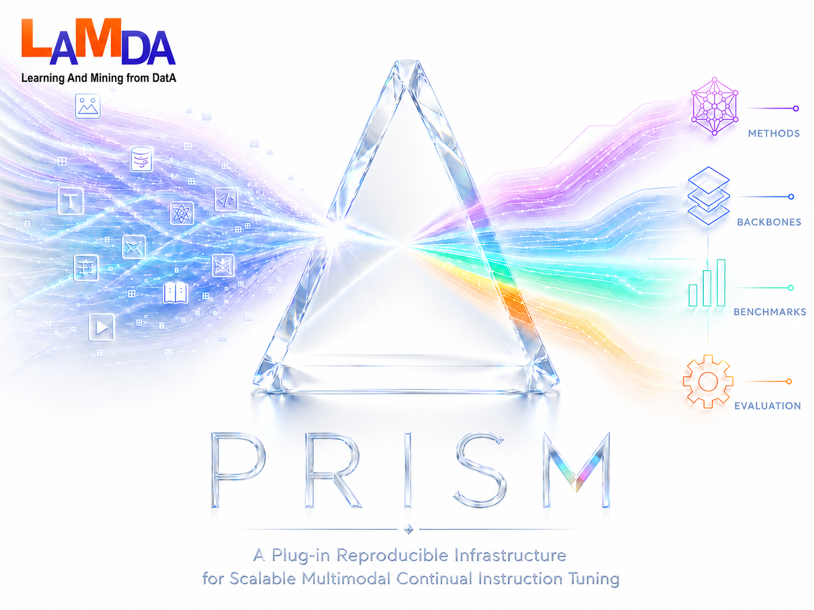

# PRISM: Multimodal Continual Instruction Tuning Toolbox
<p align="center">
  <a href="#introduction">📖 Introduction</a> •
  <a href="#methods-implemented">🧩 Methods</a> •
  <a href="#how-to-use">🚀 How To Use</a> •
  <a href="#license">📄 License</a> •
  <a href="#contact">📧 Contact</a>
</p>

<p align="center">
  
</p>

<div align="center">


<a href="https://arxiv.org/abs/2605.26110"></a>
<a href="https://lamda-cl.github.io/Prism/"></a>

</div>

**PRISM** is a plug-in, reproducible toolbox for training and evaluating **multimodal large language models (MLLMs)** under **continual instruction tuning (MCIT)**. A single entry point (`run.py`) orchestrates sequential task training, inference, and evaluation across multiple benchmarks and continual-learning methods.

---

If you use this repository, please cite:

```bibtex
@article{tang2026prism,
  title={Prism: A Plug-in Reproducible Infrastructure for Scalable Multimodal Continual Instruction Tuning},
  author={Jun-Tao Tang and Yu-Cheng Shi and Zhen-Hao Xie and Da-Wei Zhou},
  year={2026},
  journal={arXiv preprint arXiv:2605.26110},
}

@inproceedings{xie2026same,
  title={SAME: Stabilized Mixture-of-Experts for Multimodal Continual Instruction Tuning},
  author={Xie, Zhen-Hao and Tang, Jun-Tao and Shi, Yu-Cheng and Ye, Han-Jia and Zhan, De-Chuan and Zhou, Da-Wei},
  booktitle={ICML},
  year={2026}
}
```

---

## 📖 Introduction

Multimodal large language models (MLLMs) unify diverse vision and vision–language tasks into a shared instruction-following format. In real deployments, however, data and instructions arrive as streams: models must learn new tasks sequentially without erasing earlier capabilities. Standard fine-tuning suffers from catastrophic forgetting under this setting.

**Multimodal continual instruction tuning (MCIT)** addresses this by training MLLMs on a sequence of instruction-tuning stages while preserving performance on prior tasks. PRISM standardizes this workflow—benchmark definitions, method integrations, checkpoint layout, and evaluation—so that MCIT methods can be compared and extended under one infrastructure.

---

## 🧩 Methods Implemented

Each method is selected with `--method <id>` (folder under `method/custom/<id>/`).

| Abbr. | `--method` | Paper |
| :--- | :--- | :--- |
| HiDe-LLaVA | `hide_llava` | [HiDe-LLaVA: Hierarchical Decoupling for Continual Instruction Tuning of Multimodal Large Language Model](https://arxiv.org/abs/2503.12941) |
| Replay+LoRA | `replay_lora` | [LoRA: Low-Rank Adaptation of Large Language Models](https://arxiv.org/abs/2106.09685) |
| LoRA | `ft_lora` | [LoRA: Low-Rank Adaptation of Large Language Models](https://arxiv.org/abs/2106.09685) |
| O-LoRA | `olora` | [Orthogonal Subspace Learning for Language Model Continual Learning](https://arxiv.org/abs/2310.14152) |
| SMoLoRA | `smolora` | [SMoLoRA: Exploring and Defying Dual Catastrophic Forgetting in Continual Visual Instruction Tuning](https://arxiv.org/abs/2411.13949) |
| MoELoRA | `moelora` | [CoIN: A Benchmark of Continual Instruction tuNing for Multimodel Large Language Model](https://arxiv.org/abs/2403.08350) |
| CL-MoE | `clmoe` | [CL-MoE: Enhancing Multimodal Large Language Model with Dual Momentum Mixture-of-Experts for Continual Visual Question Answering](https://arxiv.org/abs/2503.00413) |
| ModalPrompt | `modal_prompt` | [ModalPrompt: Towards Efficient Multimodal Continual Instruction Tuning with Dual-Modality Guided Prompt](https://arxiv.org/abs/2410.05849) |
| EWC | `ewc` | [Overcoming catastrophic forgetting in neural networks](https://arxiv.org/abs/1612.00796) |
| DisCo | `disco` | [Federated Continual Instruction Tuning](https://arxiv.org/abs/2503.12897) |
| SAME | `same` | [SAME: Stabilized Mixture-of-Experts for Multimodal Continual Instruction Tuning](https://arxiv.org/abs/2602.01990) |
| Zero-shot | `zeroshot` | [Visual Instruction Tuning](https://arxiv.org/abs/2304.08485) |

To add a method, implement `method/custom/<your_method>/integration.py` and register with `@CLMethodFactory.register("your_method")`.

---

## 🚀 How To Use

<a id="pre-trained-weights"></a>

### Pre-trained Weights

Download from each repo’s **Model Zoo**, then set paths in `config/paths/llava_paths.py` or `config/paths/internvl_paths.py`. Select backbone via `backbone` in `config/run_config.py` (`llava` or `internvl`).

- [**LLaVA**](https://github.com/haotian-liu/LLaVA) — `llava-v1.5-7b`
- [**InternVL**](https://github.com/OpenGVLab/InternVL/tree/main/internvl_chat_llava) — `InternVL-Chat-ViT-6B-Vicuna-7B`

You can plug in additional backbones under `config/backbone/` and `backbone/`, then register them in `config/backbone/registry.py`.

<a id="datasets"></a>

### Datasets

PRISM currently supports three benchmarks:

| Benchmark | `--benchmark` | Tasks | Reference |
| :--- | :--- | :---: | :--- |
| **CoIN** | `coin` | 8 | [Paper](https://arxiv.org/abs/2403.08350) · [Benchmark](https://github.com/zackschen/CoIN/tree/CoIN) |
| **UCIT** | `ucit` | 6 | [Paper](https://arxiv.org/abs/2503.12941) · [Benchmark](https://github.com/Ghy0501/HiDe-LLaVA) |
| **TriGap** | `trigap` | 10 | [Paper](https://arxiv.org/abs/2602.01990) · [Benchmark](https://huggingface.co/datasets/JuntaoTang/TriGap) |

A benchmark typically has an **image folder** and an **instruction folder**. JSON files in the instruction folder reference image paths, so your on-disk layout must match those paths.

Then set the benchmark paths in `config/benchmarks/<benchmark>.py` (e.g. `TRIGAP_IMAGE_DIR` and `TRIGAP_INSTRUCTION_DIR` in `TriGap.py`).

For quick experiments, you can use smaller **sub-splits**: sample the instruction JSON yourself, save it with a `_sub` suffix (e.g. `train_sub.json`), and set `"use_sub_dataset": true` in `config/run_config.py`.

You can add custom benchmarks under `config/benchmarks/` and register them in `config/benchmarks/__init__.py`.

---

### Environment setup (one command)

**Requirements:** **Ubuntu 18.04**, **Python 3.10**, **NVIDIA RTX 5090**.

If you are on **Ubuntu 18.04** with **NVIDIA RTX 5090** (our tested setup), a single command sets up everything from the repository root:

```bash
bash scripts/setup_env.sh
```

This creates conda env **`prism`** (if missing), installs torch 2.8 + cu128, training/eval dependencies, flash-attn, and runs `pip install -e .`.

For other GPUs or CUDA versions, you may need to adjust PyTorch, flash-attn, and related libraries. See [`requirements/README.md`](requirements/README.md) for options (e.g. `TORCH_REQUIREMENTS=requirements/torch-cu118.txt` for older CUDA stacks, `FLASH_ATTN_WHEEL`, `SKIP_FLASH_ATTN`).

Activate and verify:

```bash
conda activate prism
python -c "import torch; import transformers; import deepspeed; print(torch.__version__, transformers.__version__)"
```

### Paths and config

Edit backbone paths under `config/paths/` and benchmark roots under `config/benchmarks/`. Tune runs via `config/run_config.py`.

After configuration, run a quick **zero-shot** inference on a single task to check weights, data paths, and GPUs (`zeroshot` uses the base MLLM checkpoint only):

```bash
python run.py infer 0 --method zeroshot
```

Then run continual training and evaluation:

```bash
python run.py train 0 1 2
python run.py infer 0 1 2
```

> **`0`, `1`, `2` are task indices** (see `config/benchmarks/<benchmark>.py`). You may train any tasks you need; stage *k* resumes from task *k*−1’s checkpoint. For **inference**, choose the checkpoint in `config/run_config.py`.
>
> CLI flags override config; omitted flags use config defaults.

---

## 📄 License

This project is released under the [MIT License](LICENSE).

---

## 🙏 Acknowledgments

We thank the following projects for their benchmarks and reference implementations used in PRISM:

- [UCIT](https://github.com/Ghy0501/HiDe-LLaVA)
- [CoIN](https://github.com/zackschen/CoIN/tree/CoIN)
- [MCITlib](https://github.com/Ghy0501/MCITlib)

---

## 📧 Contact

If you have any questions, please feel free to propose new features by opening an issue or contact the authors: Jun-Tao Tang ([juntao.tang@smail.nju.edu.cn](mailto:juntao.tang@smail.nju.edu.cn)), Yu-Cheng Shi ([231250034@smail.nju.edu.cn](mailto:231250034@smail.nju.edu.cn)), and Da-Wei Zhou ([zhoudw@lamda.nju.edu.cn](mailto:zhoudw@lamda.nju.edu.cn)). Enjoy the code.
